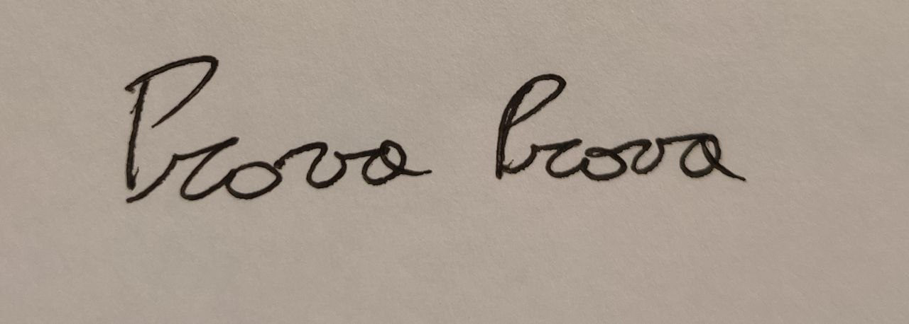

# E-Signature Maker from photo

This repository contains a Jupyter Notebook that enables you to create a signature image that you can use for signing PDF files. The program takes an input photo of your signature and uses OpenCV to isolate the pen stroke while removing the background. This produces a clean, transparent signature image that you can then save in PNG or JPEG format.

### **Features**
Simple and intuitive Jupyter Notebook interface.
Uses OpenCV to isolate the pen stroke from the background.
Generates a transparent signature image with customizable size and quality.
Saves the signature image in `PNG` or `JPEG` format for easy use in PDF signing applications.

### Usage
1. Clone the repository and open the Jupyter Notebook. 
2. Load your signature photo and adjust the parameters as needed.
3. Run the notebook to generate your signature image.
4. Save the image in PNG or JPEG format and use it for signing PDF files.

#### **Example**
- ***Input image***
    
- ***Output Image***
    